# Risky-Business
## Done by Nedal Nahanweh 
## INTRODUCTION
in this assignment we will build and evaluate several machine learning models to predict credit risk .we  will need to employ different techniques for training and evaluating models with imbalanced classes. using  the imbalanced-learn and Scikit-learn libraries to build and evaluate models.

## Files
[Credit_Risk_Ensamble](credit_risk_ensemble.ipynb)

[Credit_Risk_Resample](credit_risk_resampling.ipynb)

[Resources](Resources)
_________________________________________________________________________________________
## Resampling

#### Data Pre-Processing
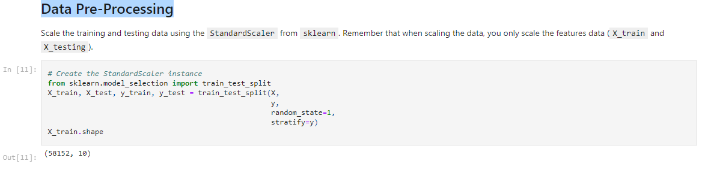

### scale the training and testing data using the `StandardScaler` from `sklearn.preprocessing`.
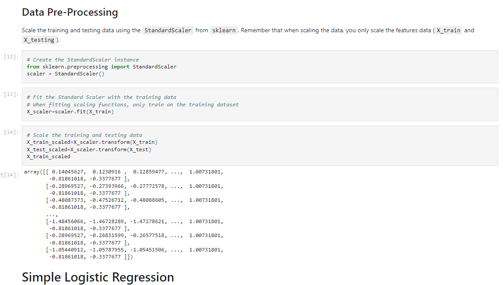

#### run a Simple Logistic Regression:
 ##### imbalanced classification report
 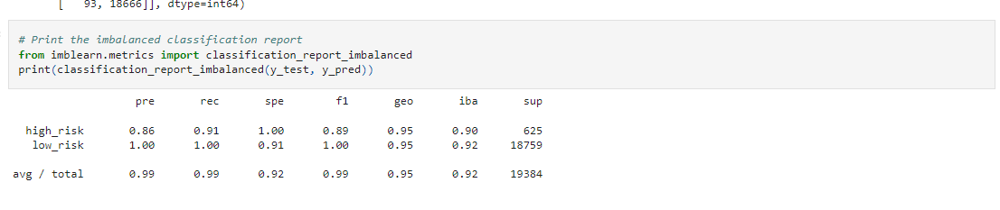
 
 
 
 
 ####  Oversampling
 
##  `` Naive Random Oversampling ``
 
 ##### Print the `imbalanced classification report` from `imblearn.metrics`.
 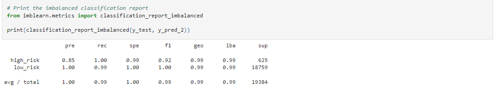
 
 
 
## `SMOTE` algorithms.
##### Print the `imbalanced classification report` from `imblearn.metrics`.

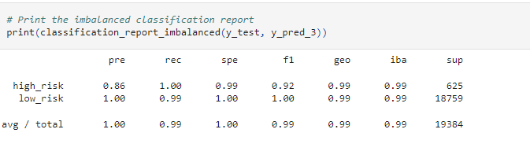
 
_ _ _ _ 
# Undersampling
### Undersample the data using the `Cluster Centroids` algorithm.

 #####  Calculate the balanced accuracy score
 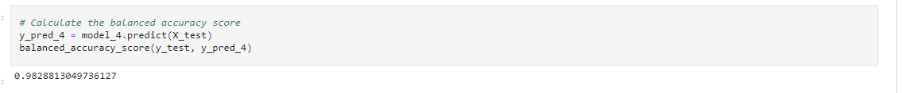

* Display the `confusion matrix`.
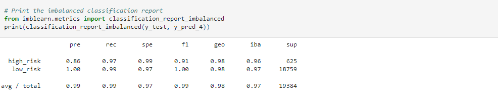

## Combination (Over and Under) Sampling using `SMOTEENN` algorithm.

 Print the `imbalanced classification report` from `imblearn.metrics`.
 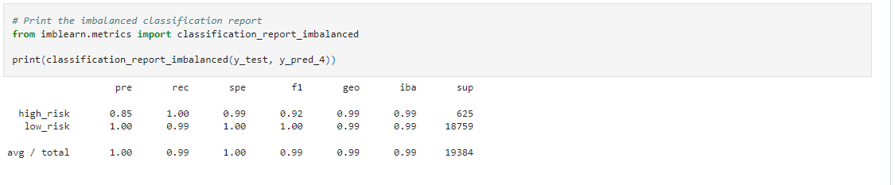
 
 
 ## Conclusion 
 * Which model had the best balanced accuracy score?

i would say , all of them have quit similr score but the naive , smote and smoteenn are the highest

* Which model had the best recall score?

all of them have the same score except the simple logestic ( without over or under sampling )

* Which model had the best geometric mean score?

they all have the same score
  
  
  ________________________________________________________________________________________
 

### Ensemble Learning

#### In this section,   we will train and compare two different ensemble classifiers to predict loan risk and evaluate each mode

we  will use the [Balanced Random Forest Classifier](https://imbalanced-learn.org/stable/references/generated/imblearn.ensemble.BalancedRandomForestClassifier.html) and the [Easy Ensemble Classifier](https://imbalanced-learn.org/stable/references/generated/imblearn.ensemble.EasyEnsembleClassifier.html). documentation for each of these 

## Balanced Random Forest Classifier

### snippts and codes 
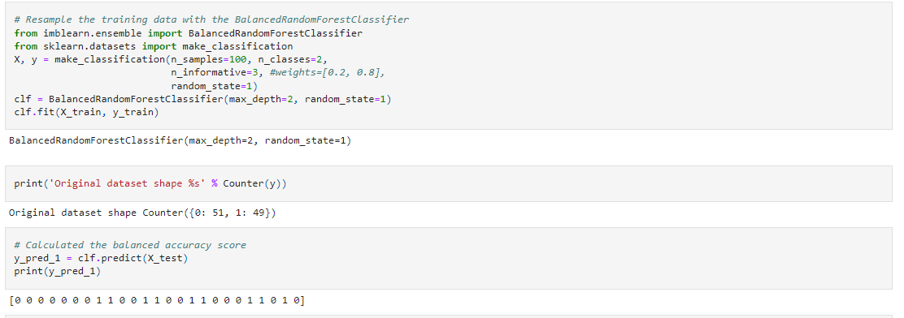

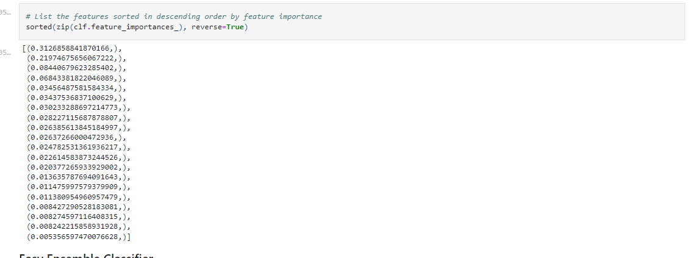

## Easy Ensemble Classifier
### snippts and codes 

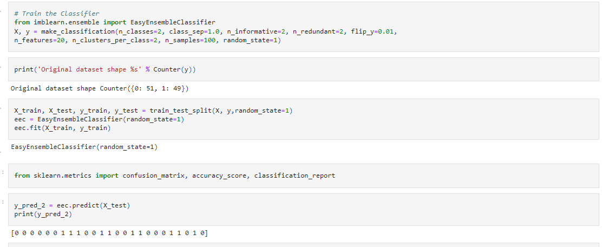

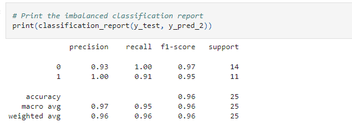

## conclusion 

* Which model had the best balanced accuracy score?

Easy Ensemble Classifier has the best score which is .96

* Which model had the best recall score?

Easy Ensemble Classifier has the best score which is .95

* Which model had the best geometric mean score?

 Easy Ensemble Classifier has the best score

* What are the top three features?

 precision recall  and f1-score
